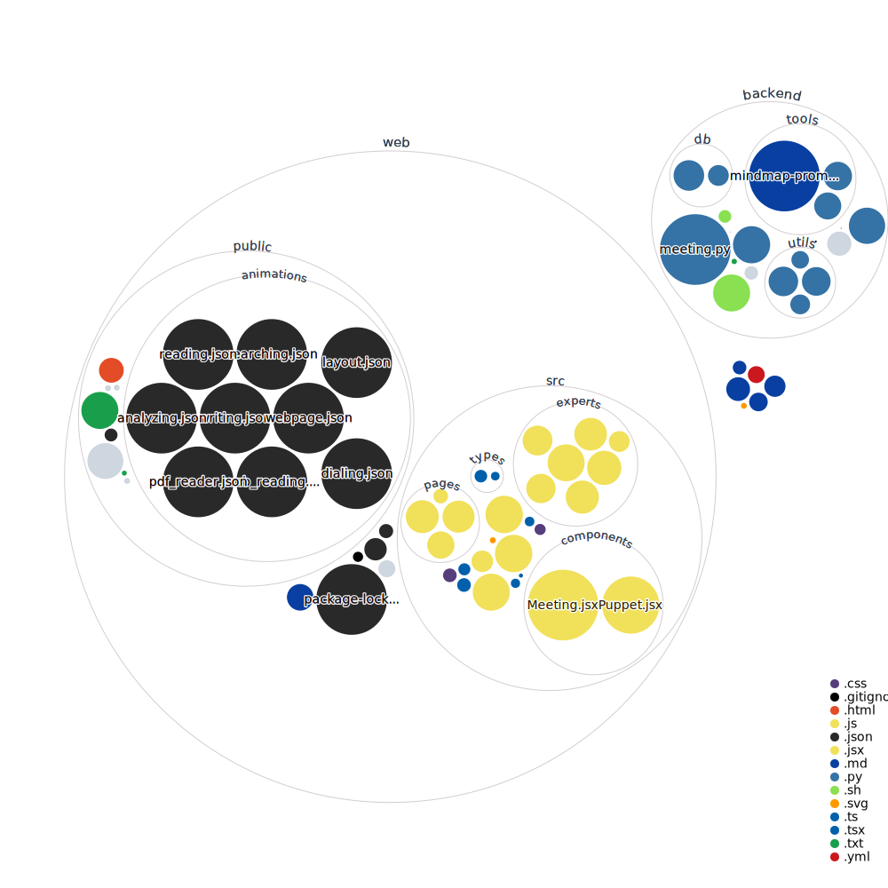

# Fenix Black
Realtime Visual AI based multi-agent Framework 

## Introduction
This web framework simulates a virtual meeting environment where AI-driven avatars, each representing specialized experts, collaborate to complete designated tasks on a meeting. The system uses a ReactJS frontend and Python FastAPI backend, with communication facilitated through Websockets.

## Features
- **Dynamic Avatars**: Utilizes [@nice-avatar-svg/react](https://www.npmjs.com/package/@nice-avatar-svg/react) for real-time avatar updates.
- **Interactive Meetings**: Avatars interact in a sequence within a virtual meeting space inspired by Google Meet.
- **Configurable Expert Components**: Users can define each expert's role, goals, backstory, and available tools.
- **Real-time Feedback**: Dynamically reflects the actions of experts during meetings, providing a comprehensive interactive experience.

## System Architecture

<i>... readme in progress ...</i>
  
  

